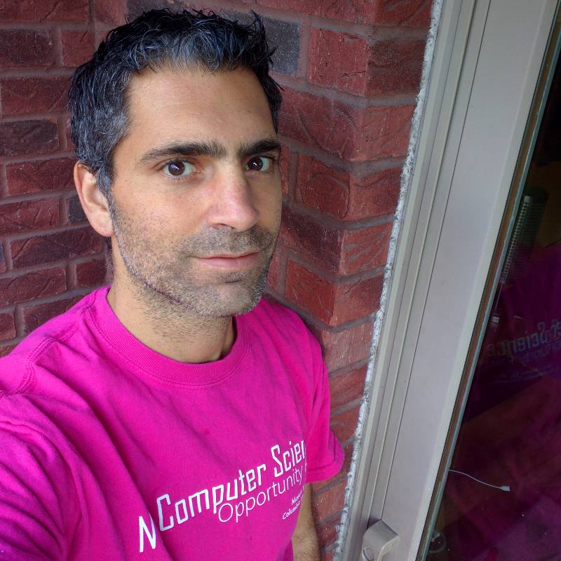

_Hi, I'm Matt Curinga._ I write software, research digital media, and teach in the [educational technology program at Adelphi University.](https://www.adelphi.edu/program/graduate/ed-tech/)

My recent **research** looks at the politics of software design. As an **instructional designer** and **programmer**, my current primary research focus is a hybrid voice user interface / graphical user interface (VUI/GUI) data analytics and visualization system built with the [MyCroft AI](https://mycroft.ai) platform. The initial data set is meant to allow non-technical users to analyze the incidents and impacts of racial and ethnic segregation in New York City public schools. As an **educator** I have been focused on teaching computer science as a critical media literacy: at the graduate and undergraduate level, and as co-founder of [Zero Day Camp](https://zeroday.camp): a non-profit that teaches computing; and creates Free Open Source Software, tools, and curricula for (critical) computer science education.

